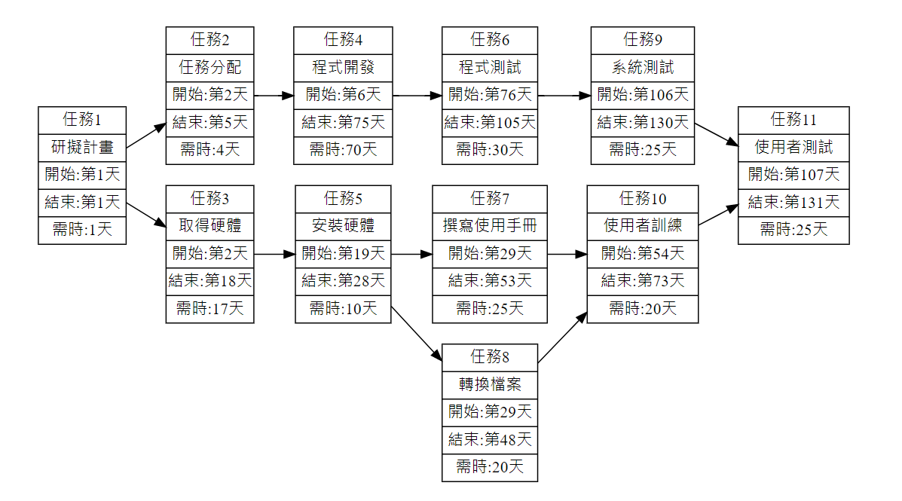
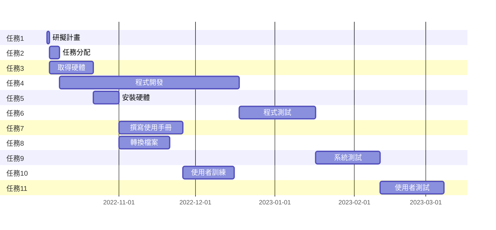
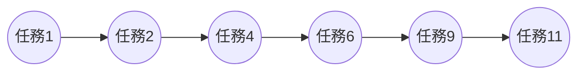

## (1)PERT
---

---
## (2)甘特圖
---

```mermaid
gantt
    section 任務1
    研擬計畫:a1, 2022-10-04, 1d
    
    section 任務2
    任務分配:a2, after a1, 4d
    
    section 任務3
    取得硬體:a3, after a1, 17d
       
    section 任務4
    程式開發:a4, after a2, 70d
    
    section 任務5
    安裝硬體:a5, after a3, 10d
      
    section 任務6
    程式測試:a6, after a4, 30d
    
    section 任務7
    撰寫使用手冊:a7, after a5, 25d
    
    section 任務8
    轉換檔案:a8, after a5, 20d
    
    section 任務9
    系統測試:a9, after a6, 25d
    
    section 任務10
    使用者訓練:a10, after a7, 20d
    
    section 任務11
    使用者測試:a11, after a9, 25d
```
---
## (3)關鍵路徑

```mermaid
graph LR
    A((任務1)) -->B((任務2)) -->C((任務4)) -->D((任務6)) -->E((任務9)) -->F((任務11))
```
### **以上用時最常**
---
